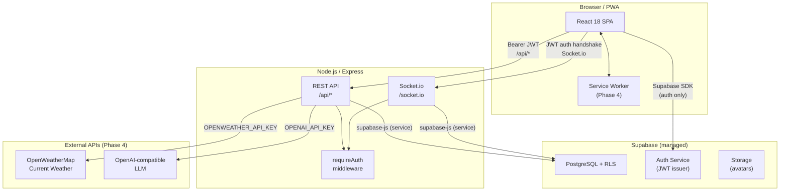

# Design Document: RunTrackPro Phased Roadmap

## Overview

This document describes the technical design for completing the RunTrackPro fitness tracking application across four development phases. The existing scaffold — React 18 + Vite frontend, Express + Socket.io backend, PostgreSQL via Supabase with RLS — provides the foundation. All new work layers on top of existing patterns without introducing new architectural paradigms.

**Phase 1** closes core gaps: Google OAuth, manual activity logging, real dashboard analytics, and streak tracking, plus the leaderboard tie-breaking correctness fix.
**Phase 2** improves GPS quality: throttling, activity-type-aware pace/speed, and elevation capture.
**Phase 3** adds social engagement: feed pagination, comments loading, challenge auto-sync, and real-time leaderboard push.
**Phase 4** completes the platform: PWA support, weather stamping on GPS activities, and AI Coach weekly advice.

Correctness requirements (Reqs 17–20) span all phases and are enforced through RLS policies, middleware invariants, and property-based tests.

---

## Architecture

The application follows a client–server model with a real-time channel layered on top:



**Key architectural constraints:**
- The backend uses a single Supabase service-role client for all DB operations; RLS provides the ownership layer.
- The frontend Supabase client is used exclusively for auth (session management, OAuth redirects). All data fetches go through the Express REST API or Socket.io.
- External API keys (`OPENWEATHER_API_KEY`, `OPENAI_API_KEY`) live only in the backend `.env`; they are never sent to the client.

---

## Components and Interfaces

### Phase 1

#### 2.1 Google OAuth — `Auth.jsx` + `AuthContext.jsx` + `/auth/callback` route

The existing Google button in `Auth.jsx` is wired to a new `signInWithGoogle()` method in `AuthContext`:

```js
// AuthContext.jsx — new method
const signInWithGoogle = async () => {
  const { error } = await supabase.auth.signInWithOAuth({
    provider: "google",
    options: { redirectTo: `${window.location.origin}/auth/callback` },
  });
  if (error) throw error;
};
```

A new `AuthCallback.jsx` page handles `/auth/callback`. Supabase's PKCE exchange happens automatically via the SDK when `exchangeCodeForSession` is called on mount. On success it navigates to `/dashboard`; on failure it navigates to `/auth?error=<message>`.

`App.jsx` gains a `<Route path="/auth/callback" element={<AuthCallback />} />`.

The `on_auth_user_created` DB trigger already handles first-time profile creation, including populating `full_name` from `raw_user_meta_data` for Google users.

#### 2.2 Manual Activity Logging — `Track.jsx` + `POST /api/activities`

`Track.jsx` gains a tabbed UI: **GPS Track** (existing) and **Manual Log** (new). The Manual Log tab renders a `ManualLogForm` component with fields: title, activity type (select), distance (km, numeric), hours/minutes (two number inputs converted to seconds server-side), calories (optional). Client-side validation:
- distance > 0 and <= 1000
- hours × 3600 + minutes × 60 > 0

On submit, calls `POST /api/activities` with `{ title, type, distance, duration_seconds, calories, route_geojson: null }`. The existing endpoint already accepts this payload and returns 201.

#### 2.3 Dashboard Analytics — `GET /api/users/me/analytics` + `Dashboard.jsx`

New route added to `users.js`:

```
GET /api/users/me/analytics
Response: {
  weekly: [{ day: "Mon", distance_km: 2.4 }, ...],  // 7 items, past 7 calendar days
  monthly: [{ month: "Jan", distance_km: 45.2 }, ...] // 6 items, past 6 calendar months
}
```

Server logic builds the 7-day array by querying activities `WHERE user_id = $1 AND created_at >= (now() - interval '7 days')`, groups by `DATE(created_at AT TIME ZONE 'UTC')`, and fills gaps with 0. Same pattern for 6-month aggregation. All distances are rounded to 1 decimal place.

`Dashboard.jsx` adds a `useEffect` that calls `GET /api/users/me/analytics` separately from the existing profile fetch, then feeds `weekly` and `monthly` data directly into the Recharts components.

#### 2.4 Activity Streak Tracking — `profiles` + post-save hook

Two new columns on `profiles`:
```sql
ALTER TABLE public.profiles
  ADD COLUMN current_streak  integer NOT NULL DEFAULT 0,
  ADD COLUMN longest_streak  integer NOT NULL DEFAULT 0;
```

A new `recalculateStreak(userId)` helper in `backend/src/lib/streak.js` runs after every activity insert (both REST and Socket.io paths). It:
1. Queries distinct UTC calendar dates with at least one activity, ordered descending.
2. Counts how many consecutive days ending on today (or yesterday if today has no activity) form an unbroken chain.
3. Updates `profiles SET current_streak = N, longest_streak = GREATEST(longest_streak, N)`.

The `GET /api/users/me` response already spreads `profileRes.data`, so `current_streak` and `longest_streak` are included automatically once the columns exist.

#### 2.5 Leaderboard Tie-Breaking — `leaderboard.js`

The in-memory aggregation loop is extended to track `latest_activity_at` (most recent `created_at`) per user. The final sort becomes:

```js
.sort((a, b) => {
  if (b.total_distance !== a.total_distance)
    return b.total_distance - a.total_distance;
  if (b.latest_activity_at !== a.latest_activity_at)
    return new Date(b.latest_activity_at) - new Date(a.latest_activity_at);
  return a.user_id.localeCompare(b.user_id);
})
```

This requires the DB query to also select `created_at` per activity row.

---

### Phase 2

#### 3.1 GPS Throttling — `useGPS.js`

A `THROTTLE_MS = 3000` constant is added at the top of `useGPS.js`. The `watchPosition` callback checks whether `Date.now() - lastAcceptedTimestampRef.current >= THROTTLE_MS` before processing a point. Points that arrive within the window are silently dropped; no distance accumulation, no socket emit, no route append.

#### 3.2 Activity-Type-Aware Pace/Speed — `useGPS.js` + `Track.jsx`

The `pace` computed value is replaced with a `metric` object:

```js
const metric = useMemo(() => {
  if (elapsed < 10 || distance < 0.05) return { value: "—", label: "Pace" };
  if (activityType === "Cycling") {
    const kmh = (distance / elapsed) * 3600;
    return { value: `${kmh.toFixed(1)} km/h`, label: "Speed" };
  }
  const minPerKm = elapsed / 60 / distance;
  const mins = Math.floor(minPerKm);
  const secs = Math.round((minPerKm - mins) * 60);
  return { value: `${mins}:${String(secs).padStart(2, "0")}/km`, label: "Pace" };
}, [activityType, elapsed, distance]);
```

`Track.jsx` renders `metric.label` and `metric.value` instead of the hardcoded "Pace" label.

#### 3.3 Elevation Capture — `useGPS.js` + `tracking.js` + schema

Schema migration:
```sql
ALTER TABLE public.activities
  ADD COLUMN elevation_gain_m numeric(7,1) NOT NULL DEFAULT 0;
```

In `useGPS.js`:
- Add `elevationGain` state (number, starts at 0) and `lastAltitudeRef`.
- On each accepted GPS point, read `pos.coords.altitude`. If non-null and `lastAltitudeRef.current` is non-null and the delta is positive, accumulate it into `elevationGain`.

In `tracking.js` `activity:stop` handler, the payload is extended with `elevation_gain_m`. The Supabase insert includes the new field.

`GET /api/activities` and `GET /api/activities/:id` select `elevation_gain_m` automatically since both use `select("*")` or explicit field lists which should be updated.

`Dashboard.jsx` "Max Elevation" record queries the user's activities for the max `elevation_gain_m`.

---

### Phase 3

#### 4.1 Feed Pagination — `useActivities.js` + `Feed.jsx`

`useActivities.js` is refactored to hold `activities` as an array that grows with each page, an `offset` state, and a `hasMore` flag. A `loadMore()` function appends the next page.

`Feed.jsx` renders a "Load more" button below the list (hidden when `!hasMore`), a loading spinner while fetching, an "All caught up 🎉" message when `hasMore` is false and activities.length > 0, and retry UI on error without clearing the existing list.

#### 4.2 Comments Loading — `GET /api/activities/:id/comments`

New route added to `activities.js`:
```
GET /api/activities/:id/comments
Response: [
  { id, body, created_at, full_name, avatar_url },
  ...
]
```

The query joins `activity_comments` with `profiles` on `user_id`, orders by `created_at` ascending, and is accessible to any authenticated user (matches existing `comments: public read` RLS).

The frontend comments panel calls this endpoint on open, displays a loading skeleton, and shows "No comments yet — be the first!" when the array is empty.

#### 4.3 Challenge Progress Auto-Sync — `challengeSync.js`

A new `backend/src/lib/challengeSync.js` module exports `syncChallengeProgress(supabase, userId)`. It:
1. Fetches all `challenge_participants` rows for the user where the challenge's `deadline > now()`.
2. For each: fetches qualifying activities (`user_id = userId AND created_at >= joined_at AND created_at < deadline`).
3. Computes `current_value` (sum of distance for Distance, sum of `ROUND(duration_seconds / 60.0, 2)` for Time).
4. Upserts `current_value` in a single batch.

This function is called from:
- `POST /api/activities` — after the insert succeeds.
- `activity:stop` Socket.io handler — after the Supabase insert succeeds.

If `syncChallengeProgress` throws, the error is logged but the activity save is not rolled back (activity persistence takes priority over challenge sync).

#### 4.4 Real-Time Leaderboard Push — `tracking.js` + `activities.js` + `useLeaderboard.js`

The `io` instance is made available to the REST router via `app.set("io", io)`. Both activity-save paths emit:
```js
io.emit("leaderboard:updated", { period: "weekly" });
```

`useLeaderboard.js` gains a Socket.io listener on `leaderboard:updated`. The re-fetch is debounced with a 2-second `setTimeout`. When the user is not on the Leaderboard page, a `stale` flag is set and the data is refreshed on next navigation to that page.

---

### Phase 4

#### 5.1 PWA — `manifest.json` + `sw.js` + `vite-plugin-pwa`

`vite-plugin-pwa` is added as a dev dependency. It generates the service worker and handles registration. Config in `vite.config.js`:

```js
VitePWA({
  registerType: "prompt",      // manual update confirmation
  strategies: "generateSW",
  workbox: {
    navigateFallback: "/index.html",
    runtimeCaching: [{
      urlPattern: /^https?:\/\/.*\/api\//,
      handler: "NetworkFirst",
      options: { cacheName: "api-cache", networkTimeoutSeconds: 5 }
    }],
  },
  manifest: {
    name: "RunTrackPro",
    short_name: "RunTrackPro",
    start_url: "/",
    display: "standalone",
    background_color: "#ffffff",
    theme_color: "#FC4C02",
    icons: [
      { src: "/icons/icon-192.png", sizes: "192x192", type: "image/png" },
      { src: "/icons/icon-512.png", sizes: "512x512", type: "image/png" },
    ],
  },
})
```

`registerType: "prompt"` means the new SW waits until `workbox.messageSkipWaiting()` is called. A `useServiceWorker` hook listens for the `waiting` SW event and triggers a non-blocking toast: "Update available — tap to reload". Tapping calls `skipWaiting()` then `window.location.reload()`.

An `OfflineBanner` component subscribes to `window.addEventListener("offline")` and renders a sticky banner when offline, hiding on `"online"`.

#### 5.2 Weather Stamping — `activities.js` + schema

Schema migration:
```sql
ALTER TABLE public.activities
  ADD COLUMN weather_condition    text,
  ADD COLUMN temperature_celsius  numeric(4,1),
  ADD COLUMN wind_speed_kmh       numeric(5,1);
```

In `tracking.js`, after the GPS activity is inserted, a `fetchWeather(lat, lng)` helper is called with the last GPS point. It has a 5-second `AbortController` timeout. On success, the activity row is updated with weather fields. On any error (network, timeout, missing coords), the error is logged and the activity remains saved without weather data.

`fetchWeather` in `backend/src/lib/weather.js`:
```js
async function fetchWeather(lat, lng) {
  const url = `https://api.openweathermap.org/data/2.5/weather?lat=${lat}&lon=${lng}&units=metric&appid=${process.env.OPENWEATHER_API_KEY}`;
  const controller = new AbortController();
  const timeout = setTimeout(() => controller.abort(), 5000);
  const res = await fetch(url, { signal: controller.signal });
  clearTimeout(timeout);
  const data = await res.json();
  return {
    weather_condition: data.weather?.[0]?.main ?? null,
    temperature_celsius: data.main?.temp ?? null,
    wind_speed_kmh: data.wind?.speed != null ? data.wind.speed * 3.6 : null,
  };
}
```

Manual activities (REST path) skip weather entirely — `route_geojson` is null, so no coordinate is available.

`ActivityCard.jsx` renders a weather chip (`☀️ 18°C`) when `weather_condition` and `temperature_celsius` are non-null.

#### 5.3 AI Coach — `GET /api/users/me/coach`

New route in `users.js`:
```
GET /api/users/me/coach
Response: { advice: "<string>" }
```

Logic:
1. Fetch last 7 days of activities for `req.user.id`.
2. If zero activities, return fallback immediately.
3. Build a stats-only prompt (no name, no email): total distance, total duration in minutes, activity count, activity types.
4. POST to OpenAI-compatible API with `process.env.OPENAI_API_KEY`, 10-second timeout.
5. On success, return `{ advice: response.choices[0].message.content }`.
6. On any error/timeout, return fallback `{ advice: "Keep it up! Log more activities this week to unlock personalised tips." }`.

`Dashboard.jsx` renders an "AI Coach" card below the personal records section, calling `GET /api/users/me/coach` on mount.

---

## Data Models

### Schema Migrations (net-new columns/tables)

```sql
-- Phase 1: Streak columns on profiles
ALTER TABLE public.profiles
  ADD COLUMN IF NOT EXISTS current_streak  integer NOT NULL DEFAULT 0,
  ADD COLUMN IF NOT EXISTS longest_streak  integer NOT NULL DEFAULT 0;

-- Phase 2: Elevation on activities
ALTER TABLE public.activities
  ADD COLUMN IF NOT EXISTS elevation_gain_m numeric(7,1) NOT NULL DEFAULT 0;

-- Phase 4: Weather columns on activities
ALTER TABLE public.activities
  ADD COLUMN IF NOT EXISTS weather_condition    text,
  ADD COLUMN IF NOT EXISTS temperature_celsius  numeric(4,1),
  ADD COLUMN IF NOT EXISTS wind_speed_kmh       numeric(5,1);
```

No new tables are introduced. All changes are additive (nullable or with defaults) to preserve backward compatibility.

### Updated `activities` Row Shape

| Column | Type | New? | Notes |
|---|---|---|---|
| id | uuid | — | PK |
| user_id | uuid | — | FK → profiles |
| title | text | — | |
| type | text | — | Running/Cycling/Walking/Hiking |
| distance | numeric(8,2) | — | km |
| duration_seconds | integer | — | |
| calories | integer | — | |
| route_geojson | jsonb | — | nullable |
| elevation_gain_m | numeric(7,1) | Phase 2 | default 0 |
| weather_condition | text | Phase 4 | nullable |
| temperature_celsius | numeric(4,1) | Phase 4 | nullable |
| wind_speed_kmh | numeric(5,1) | Phase 4 | nullable |
| created_at | timestamptz | — | |

### Updated `profiles` Row Shape

| Column | Type | New? | Notes |
|---|---|---|---|
| ... (existing) | | | |
| current_streak | integer | Phase 1 | default 0 |
| longest_streak | integer | Phase 1 | default 0 |

---

## API Endpoint Specifications

### New Endpoints

#### `GET /api/users/me/analytics` (Phase 1)
- **Auth:** Bearer JWT required
- **Query params:** none
- **Response 200:**
  ```json
  {
    "weekly": [
      { "day": "Mon", "distance_km": 5.2 },
      { "day": "Tue", "distance_km": 0 },
      ...
    ],
    "monthly": [
      { "month": "Jan", "distance_km": 42.1 },
      ...
    ]
  }
  ```
- **Errors:** 401 (no/invalid JWT), 500

#### `GET /api/activities/:id/comments` (Phase 3)
- **Auth:** Bearer JWT required
- **Response 200:**
  ```json
  [
    {
      "id": "uuid",
      "body": "Great run!",
      "created_at": "2024-01-15T09:30:00Z",
      "full_name": "Alice Smith",
      "avatar_url": "https://..."
    }
  ]
  ```
- **Errors:** 401, 404 (activity not found), 500

#### `GET /api/users/me/coach` (Phase 4)
- **Auth:** Bearer JWT required
- **Response 200:**
  ```json
  { "advice": "You ran 3 times this week for 24km total..." }
  ```
- **Errors:** 401, 500 (returns fallback, not error)

### Modified Endpoints

#### `POST /api/activities` (Phase 1, 2, 3, 4)
- Unchanged request/response contract.
- Side effects added: `recalculateStreak(userId)`, `syncChallengeProgress(supabase, userId)`, `io.emit("leaderboard:updated")`.
- Phase 2: now persists `elevation_gain_m` when provided.
- Phase 4: weather stamping happens only for GPS activities (skipped when `route_geojson` is null).

#### `GET /api/leaderboard` (Phase 1)
- Response augmented with `latest_activity_at` used for tie-breaking sort.
- Query now selects `created_at` per activity row for tie-breaking.

#### `GET /api/users/me` (Phase 1)
- Response now includes `current_streak` and `longest_streak` from the profiles row.

#### `GET /api/activities` and `GET /api/activities/:id` (Phase 2, 4)
- Response includes `elevation_gain_m`, `weather_condition`, `temperature_celsius`, `wind_speed_kmh`.

---

## Socket.io Event Contracts

### Existing Events (unchanged)

| Event | Direction | Payload |
|---|---|---|
| `activity:start` | C→S | `{ type }` |
| `location:update` | C→S | `{ lat, lng, accuracy, timestamp }` |
| `activity:stop` | C→S | `{ title, distance, duration_seconds, calories }` |
| `activity:saved` | S→C | saved activity object |
| `friend:activity:start` | S→C (room) | `{ userId, type, startedAt }` |
| `friend:location` | S→C (room) | `{ userId, lat, lng, ... }` |
| `friend:activity:stop` | S→C (room) | `{ userId }` |
| `watch:user` | C→S | `{ targetUserId }` |
| `unwatch:user` | C→S | `{ targetUserId }` |

### Modified Events (Phase 2, 3, 4)

#### `activity:stop` — extended payload (Phase 2)
```json
{
  "title": "Morning Run",
  "distance": 5.2,
  "duration_seconds": 1800,
  "calories": 364,
  "elevation_gain_m": 87.3
}
```

### New Events (Phase 3)

#### `leaderboard:updated` — server broadcasts to all connected clients
```json
{ "period": "weekly" }
```
Emitted after any activity is saved (both REST and Socket.io paths). Clients debounce the resulting re-fetch by 2 seconds.

---

## PWA Architecture

```
frontend/public/
├── manifest.json          (generated by vite-plugin-pwa)
├── icons/
│   ├── icon-192.png
│   └── icon-512.png
└── sw.js                  (generated by workbox via vite-plugin-pwa)
```

### Caching Strategy

| Resource type | Strategy | Rationale |
|---|---|---|
| App shell (HTML/CSS/JS bundles) | Cache-First | Static assets change only on deploy |
| `/api/*` requests | Network-First, 5s timeout | Fresh data preferred; cached fallback when offline |
| Supabase CDN assets | Cache-First | Avatar images, static assets |
| External images | Stale-While-Revalidate | Background refresh without blocking |

### Update Flow

1. New SW is installed but stays in `waiting` state (not `activate`d).
2. `useServiceWorker` hook detects `waiting` state via `navigator.serviceWorker.ready`.
3. A non-blocking `<UpdateBanner />` toast renders: "Update available — tap to reload".
4. User taps → `postMessage({ type: "SKIP_WAITING" })` → SW activates → `window.location.reload()`.
5. Automatic activation without user confirmation is explicitly **not** done.

### Offline Behaviour

An `OfflineBanner` component mounts at the app root, subscribing to `window` `"online"`/`"offline"` events. When offline it renders a sticky amber banner. API call failures while offline are caught and show an error toast rather than a silent failure.

---

## Security Design

### RLS Policies (Supabase)

All user-data tables have RLS enabled. The complete ownership matrix:

| Table | SELECT | INSERT | UPDATE | DELETE |
|---|---|---|---|---|
| profiles | authenticated | (trigger only) | `auth.uid() = id` | cascade |
| activities | authenticated | `auth.uid() = user_id` | — | `auth.uid() = user_id` |
| activity_likes | authenticated | `auth.uid() = user_id` | — | `auth.uid() = user_id` |
| activity_comments | authenticated | `auth.uid() = user_id` | — | `auth.uid() = user_id` |
| challenge_participants | authenticated | `auth.uid() = user_id` | — (server SECURITY DEFINER fn) | `auth.uid() = user_id` |
| user_achievements | `auth.uid() = user_id` | (trigger only) | — | cascade |

Challenge progress updates (`current_value`) require bypassing user-level RLS since they run as a server-side aggregation. This is done via a Supabase `SECURITY DEFINER` PostgreSQL function OR by using the service-role client that already bypasses RLS. The backend already uses the service-role client (`supabase.js` in `/lib`), so challenge sync updates are authoritative.

### JWT Middleware

`requireAuth` in `middleware/auth.js` validates every Bearer token via `supabase.auth.getUser(token)` before any route handler executes. This call validates the JWT signature with Supabase's JWKS. Any invalid, expired, or missing token returns 401 immediately.

The `io.use()` middleware in `tracking.js` applies the same verification pattern for all Socket.io connections.

### API Key Handling

| Key | Storage | Access |
|---|---|---|
| `OPENWEATHER_API_KEY` | `backend/.env` | Server-side only, never in response |
| `OPENAI_API_KEY` | `backend/.env` | Server-side only, never in response |
| `SUPABASE_SERVICE_ROLE_KEY` | `backend/.env` | Server-side only |
| `VITE_SUPABASE_ANON_KEY` | `frontend/.env` | Public (Supabase anon key — RLS enforced) |

The `GET /api/users/me/coach` and weather endpoints never include raw API responses or key material in client-facing payloads. Error messages are sanitised before reaching the client.

### CORS

The backend Express CORS config allows only `CLIENT_URL` (from env). Socket.io is similarly restricted. In production, `CLIENT_URL` is set to the exact deployed frontend domain.

---

## Correctness Properties

*A property is a characteristic or behavior that should hold true across all valid executions of a system — essentially, a formal statement about what the system should do. Properties serve as the bridge between human-readable specifications and machine-verifiable correctness guarantees.*

The following properties are derived from the cross-phase correctness requirements (Reqs 17–20). They are implemented as property-based tests using [fast-check](https://fast-check.io/) (JavaScript), which is appropriate for the existing Node.js/React stack.

---

### Property 1: JWT Isolation on Protected Endpoints

*For any* authenticated user with JWT subject `jwtUserId` and any other user ID value `attemptedId` supplied as a query parameter or request body field, the analytics endpoint and coach endpoint SHALL query the database exclusively using `jwtUserId`, producing results identical to a request made without any `attemptedId` override.

**Validates: Requirements 17.7, 17.8**

---

### Property 2: GPS Distance Accumulation Integrity

*For any* sequence of GPS coordinates, the total accumulated distance returned by the GPS tracker SHALL equal the sum of Haversine distances (Earth radius 6371 km) for all consecutive non-discarded point pairs, where a point is discarded if and only if its Haversine distance from the previous accepted point exceeds 500 metres.

**Validates: Requirements 18.1, 18.2, 18.4**

---

### Property 3: GPS Filtering and Route Correctness

*For any* sequence of GPS coordinates processed by the GPS tracker, the resulting GeoJSON LineString coordinates SHALL contain exactly the accepted (non-discarded) points in reception order as `[longitude, latitude]` pairs, and SHALL contain no discarded points (those farther than 500 metres from the previous accepted point).

**Validates: Requirements 18.2, 18.5**

---

### Property 4: Challenge Progress — Distance Accuracy

*For any* user, any Distance challenge with a `joined_at` and `deadline`, and any set of activities belonging to that user, the computed `current_value` in `challenge_participants` SHALL equal the sum of `distance` values for all activities where `created_at >= joined_at` AND `created_at < deadline`, rounded to 2 decimal places.

**Validates: Requirements 19.1**

---

### Property 5: Challenge Progress — Time Accuracy

*For any* user, any Time challenge with a `joined_at` and `deadline`, and any set of activities belonging to that user, the computed `current_value` in `challenge_participants` SHALL equal the sum of `ROUND(duration_seconds / 60.0, 2)` for all qualifying activities within the time window.

**Validates: Requirements 19.2**

---

### Property 6: Challenge Progress Idempotence

*For any* user, any active challenge, and any set of qualifying activities, calling `syncChallengeProgress(userId, challengeId)` once and calling it a second time immediately after SHALL produce the same `current_value`, with no observable difference in the database state between the first and second call.

**Validates: Requirements 19.3**

---

### Property 7: Leaderboard Aggregation Correctness

*For any* set of users with associated activities and any leaderboard period (`weekly`, `monthly`, `alltime`), each user's `total_distance` in the leaderboard response SHALL equal the precise sum of their `activities.distance` values where `created_at >= period_start`, and SHALL not include any activity outside the period window.

**Validates: Requirements 20.1**

---

### Property 8: Period Start Calculation

*For any* UTC datetime value, `getWeeklyPeriodStart(date)` SHALL return the most recent Monday at 00:00:00.000 UTC on or before that date, and `getMonthlyPeriodStart(date)` SHALL return the first calendar day of that date's UTC month at 00:00:00.000 UTC. Both functions SHALL be pure (no side effects, same input always produces same output).

**Validates: Requirements 20.2, 20.3**

---

### Property 9: Leaderboard Tie-Breaking Sort Stability

*For any* leaderboard result set containing two or more users with equal `total_distance`, the user with the strictly later most-recent activity `created_at` SHALL have a strictly lower (better) rank number. Where both `total_distance` and most-recent `created_at` are equal, the user with the lexicographically smaller `user_id` SHALL have the lower rank number. The combined sort SHALL be totally ordered (no two distinct users share the same rank).

**Validates: Requirements 13.1, 13.2, 20.4, 20.5**

---

### Property 10: Leaderboard Size Cap

*For any* leaderboard period and any number of users with qualifying activities, the leaderboard response SHALL contain at most 20 entries.

**Validates: Requirements 20.6**

---

### Property 11: `is_me` Flag Correctness

*For any* leaderboard response and any authenticated user with `jwtUserId`, exactly zero or one entry SHALL have `is_me = true`, and that entry (if it exists) SHALL have `user_id === jwtUserId`. No other entry SHALL have `is_me = true`.

**Validates: Requirements 20.7**

---

## Error Handling

### Backend Error Strategy

All route handlers follow a consistent pattern:

```
try {
  // happy path
} catch (err) {
  console.error("[route] context:", err);
  res.status(500).json({ error: "Human-readable message without internal details" });
}
```

Specific error scenarios:

| Scenario | Handling |
|---|---|
| JWT missing / invalid | `requireAuth` returns 401 immediately, no DB query |
| Supabase DB error | Log full error; return 500 with generic message |
| Activity not found | Return 404 |
| Duplicate like/join | Return 409 |
| OpenWeatherMap timeout/failure | Log; save activity without weather fields; do not block |
| LLM API timeout/failure | Log; return fallback advice string; HTTP 200 |
| Challenge sync failure | Log; activity save succeeds; sync error is non-fatal |
| Streak recalculation failure | Log; activity save succeeds; streak error is non-fatal |
| Leaderboard:updated emit failure | Log; do not block activity save |

### Frontend Error Strategy

- **API errors:** `api.js` wraps `fetch` calls; non-2xx responses throw with the error message from the response body. Callers catch and display a `<Toast>` or inline error message.
- **GPS errors:** `useGPS` exposes an `error` string; `Track.jsx` renders it in the UI.
- **Offline:** `OfflineBanner` shown; pending API calls fail gracefully via the service worker network-first fallback returning a cached response or the error toast.
- **Auth errors (OAuth):** `AuthCallback.jsx` catches exchange failures, redirects to `/auth` with a query param error message.

---

## Testing Strategy

### Dual Testing Approach

Both unit/integration tests and property-based tests are used. They are complementary: unit tests verify concrete scenarios and catch specific bugs; property tests verify invariants across large input spaces and catch edge cases that specific examples miss.

### Property-Based Testing

**Library:** [fast-check](https://fast-check.io/) — mature, actively maintained, works with any JavaScript test runner.
**Runner:** Vitest (aligns with Vite-based frontend; can run backend tests too via a shared test config).
**Minimum iterations:** 100 per property (fast-check default is 100; increase to 500 for mathematical properties like Haversine).

Each property test file is tagged:

```js
// Feature: runtrackpro-phased-roadmap, Property 2: GPS Distance Accumulation Integrity
it("accumulates distance correctly across any point sequence", () => {
  fc.assert(fc.property(
    fc.array(fc.record({ lat: fc.float(...), lng: fc.float(...) }), { minLength: 2 }),
    (points) => { /* ... */ }
  ), { numRuns: 500 });
});
```

### Test Files Structure

```
backend/src/__tests__/
  unit/
    streak.test.js            — recalculateStreak examples
    leaderboard.test.js       — aggregation and sort examples
    weather.test.js           — fetchWeather mock examples
  properties/
    gpsIntegrity.property.js  — Properties 2, 3 (fast-check)
    challengeSync.property.js — Properties 4, 5, 6 (fast-check)
    leaderboard.property.js   — Properties 7, 8, 9, 10, 11 (fast-check)
    authIsolation.property.js — Property 1 (fast-check)

frontend/src/__tests__/
  unit/
    ManualLogForm.test.jsx     — validation examples
    useGPS.test.js             — throttle behavior examples
  properties/
    useGPS.property.js         — Properties 2, 3 (fast-check, jsdom)
```

### Unit Test Focus

Unit tests cover:
- Manual log form validation (zero distance, zero duration, distance > 1000, all-whitespace title)
- Streak calculation for specific date sequences (gap today, gap yesterday, all-time consecutive)
- OAuth callback: success navigates to dashboard, failure shows error
- Weather stamping: fallback when API throws, null coords skip fetch
- LLM coach: fallback on timeout, zero-activity short-circuit, PII not in prompt
- Leaderboard sort: specific tie-break scenarios with known expected rank order

### Integration Tests

- `GET /api/users/me/analytics` returns correct structure and respects user isolation
- `GET /api/activities/:id/comments` returns comments ordered by `created_at` asc
- `POST /api/activities` triggers streak recalc and challenge sync (with Supabase test DB or mocks)
- Socket.io `activity:stop` emits `leaderboard:updated` to all connected clients

### Property Test Generators

Key generators for the property tests:

```js
// GPS coordinate generator (valid lat/lng ranges)
const gpsPoint = fc.record({
  lat: fc.float({ min: -90, max: 90 }),
  lng: fc.float({ min: -180, max: 180 }),
  altitude: fc.option(fc.float({ min: -100, max: 8849 }), { nil: null }),
});

// GPS sequence with occasional large jumps (tests 500m filter)
const gpsSequenceWithJumps = fc.array(gpsPoint, { minLength: 2, maxLength: 50 }).map(
  injectOccasionalJumps  // randomly multiplies some coordinate deltas to exceed 500m
);

// Challenge activity set generator
const challengeActivitySet = fc.record({
  challenge: fc.record({ category: fc.constantFrom("Distance", "Time"), target: fc.float({ min: 1, max: 1000 }) }),
  joinedAt: fc.date(),
  deadline: fc.date(),
  activities: fc.array(fc.record({ distance: fc.float({ min: 0, max: 100 }), duration_seconds: fc.integer({ min: 0, max: 86400 }), createdAt: fc.date() })),
});

// Leaderboard user set generator (including users with identical distances for tie-break testing)
const leaderboardUserSet = fc.array(
  fc.record({ userId: fc.uuidV4(), totalDistance: fc.float({ min: 0, max: 200 }), latestAt: fc.date() }),
  { minLength: 1, maxLength: 50 }
);
```
